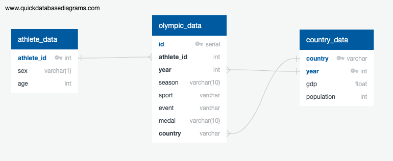

# ETL-Project-Olympics-Data

### Produced by:
* Kim Price
* Marti Reisinger
* Arnold Schultz

# Overview:
This project creates and populates a PostgreSQL database that could be used to analyze correlations between Olympic results, country population and GDP.   
The database has the following schema:   


## Data Sets:

* 120 years of Olympic history: athletes and results: 45.5MB (2 files)
    * Link: https://www.kaggle.com/datasets/heesoo37/120-years-of-olympic-history-athletes-and-results?resource=download
    * Description: Two CSV files containing the Olympic athletes for all countries for the last 120 years.  The first file contains the athletes and the Olympic Committee they represented.  The second file contains the translation of Olympic committee to country.

* World Population: 185 KB
	* Link: https://data.worldbank.org/indicator/SP.POP.TOTL
    * Description: CSV containing the population for all countries from 1960 through 2021
	
* World GDP: 269 KB
	* Link:  https://data.worldbank.org/indicator/NY.GDP.MKTP.CD?end=2021&start=1960
    * Description: CSV containing the GDP for all countries from 1960 through 2021.

# Instructions to recreate the database

1. Clone the Repo https://github.com/Mreisinger1/ETL-Project-Olympics-Data
1. Open ``pgAdmin`` ``PostgreSQL``
1. Create a new database named ``olympic_db``.
1. Use the ``olympic_DB_Table_Create.sql`` file to create the tables.
1. Run the next line in an environment that has ``pandas``, ``sqlalchemy``, ``numpy`` and using ``python 3.8``
1. Run ``jupyter notebook`` and open ``Olympic_ETL.ipynb``.
1. Verify and update as needed the ``username``, ``port`` and ``password`` in the ``LOAD`` section of the notebook to match your PostgreSQL.
1. Run the notebook.
1. Run the following test query to verify your database is populated correctly:

```sql
   select od.medal, cd.country, od.year from "olympic_data" as od
   left join "country_data" as cd on od.country = cd.country
   where  cd.population < 400000000 and cd.population > 250000000 and od.medal = 'Gold';
```
